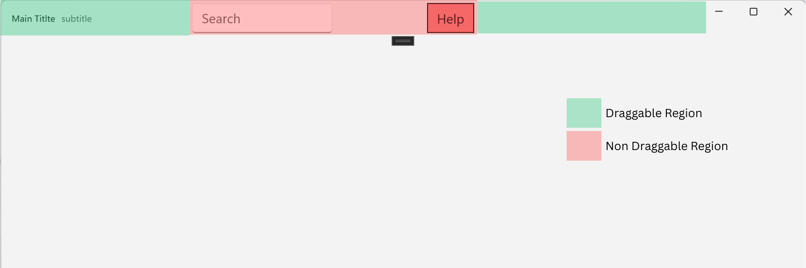
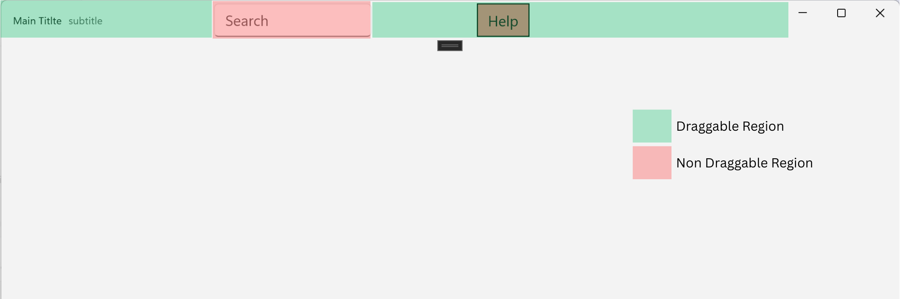
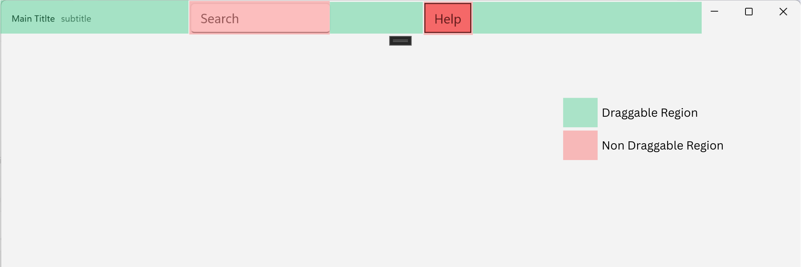

TitleBar Drag Region API Specification
===

# Background

Custom title bar layouts often combine **interactive controls** and **non‑interactive visual elements** using containers such as `Grid`, `StackPanel`, or deeper nested structures. While this flexibility enables rich and branded title bar designs, it also introduces ambiguity when determining **which parts of the title bar should behave as draggable regions** for moving the window.

Under the **current default behavior**, the framework treats the entire `TitleBar.Content` area as the primary drag surface and then subtracts (or *"punches holes"* from) regions that should not initiate window dragging. This approach works reasonably well for dense, predictable layouts. However, it **fails in scenarios with empty gaps, uneven spacing, nested templates, or dynamically generated UI**, where the system cannot reliably infer developer intent. These situations can lead to **unexpected non‑draggable gaps**, creating inconsistent or unintuitive window‑drag behavior for users.

This problem has been raised and discussed by developers in the WinUI community, for example in: **[#10421](https://github.com/microsoft/microsoft-ui-xaml/issues/10421)**.

This specification evaluates multiple approaches to defining draggable and non‑draggable regions within `TitleBar.Content`, and proposes a solution that balances **predictable defaults** with **developer‑provided intent**.

---

# Conceptual pages (How To)

#### Problem example: gaps become non-draggable

```xml
<TitleBar Title="Main Titlte" Subtitle="subtitle" x:Name="titleBar">
    <TitleBar.Content>
        <Grid>
            <Grid.ColumnDefinitions>
                <ColumnDefinition Width="150" />
                <ColumnDefinition Width="200" />
                <ColumnDefinition Width="50" />
            </Grid.ColumnDefinitions>
            <Border Grid.Column="0" Background="LightBlue" BorderBrush="Black" BorderThickness="1">
                <AutoSuggestBox PlaceholderText="Search"/>
            </Border>
            <Border Grid.Column="1" />
            <Border Grid.Column="2" Background="LightCoral" BorderBrush="Black" BorderThickness="1">
                <TextBlock Text="Help" VerticalAlignment="Center" HorizontalAlignment="Center" />
            </Border>
        </Grid>
    </TitleBar.Content>
</TitleBar>
```

#### Output:


In this simple layout:
- Column 0 contains **Sample Search Box**
- Column 2 contains **Help**
- Column 1 is **empty visual space** that may become a non-draggable gap

Even in simple cases, it is non-trivial for the framework to automatically classify such gaps as draggable or non-draggable. More complex layouts—nested controls, templated UI, and dynamic content—make automatic detection even harder.

## Approaches Overview

### Approach 1 — Fully Automatic Control Detection (Framework-only)
The framework recursively traverses the visual tree and treats *all interactive controls* (e.g., `Button`, `AutoSuggestBox`, `ComboBox`) as **non‑draggable** by default. The remaining areas are considered draggable.

**Pros**
- Zero developer annotation; works out of the box.

**Cons**
- Developers **cannot customize** exceptions easily (e.g., some products allow dragging over ribbon controls while others do not over the search box); per‑app customization is blocked.

**XAML sample**
```xml
<TitleBar Title="Main Titlte" Subtitle="subtitle" x:Name="titleBar">
    <TitleBar.Content>
        <Grid>
            <Grid.ColumnDefinitions>
                <ColumnDefinition Width="150" />
                <ColumnDefinition Width="200" />
                <ColumnDefinition Width="50" />
            </Grid.ColumnDefinitions>
            <Border Grid.Column="0" Background="LightBlue" BorderBrush="Black" BorderThickness="1">
                <AutoSuggestBox PlaceholderText="Search"/>
            </Border>
            <Border Grid.Column="1" />
            <Border Grid.Column="2" Background="LightCoral" BorderBrush="Black" BorderThickness="1">
                <TextBlock Text="Help" VerticalAlignment="Center" HorizontalAlignment="Center" />
            </Border>
        </Grid>
    </TitleBar.Content>
</TitleBar>
```
#### Output:


---

### Approach 2 — Developer‑specified Exclusion (Manual)
Make the **entire content region draggable by default** and have developers explicitly **exclude** elements that should *not* participate in drag by setting the attached property **`TitleBar.IsDragRegion="False"`** on those elements.

**Pros**
- **Granular control**: developers can mark exactly what should or should not drag.

**Cons**
- **Tedious** to annotate every control in complex layouts; shifts burden to app authors rather than the framework.

**XAML sample**
```xml
<TitleBar Title="Main Titlte" Subtitle="subtitle" x:Name="titleBar">
    <TitleBar.Content>
        <Grid>
            <Grid.ColumnDefinitions>
                <ColumnDefinition Width="150" />
                <ColumnDefinition Width="200" />
                <ColumnDefinition Width="50" />
            </Grid.ColumnDefinitions>
            <Border Grid.Column="0" Background="LightBlue" BorderBrush="Black" BorderThickness="1">
                <AutoSuggestBox PlaceholderText="Search" TitleBar.IsDragRegion="False"/>
            </Border>
            <Border Grid.Column="1" />
            <Border Grid.Column="2" Background="LightCoral" BorderBrush="Black" BorderThickness="1">
                <TextBlock Text="Help" VerticalAlignment="Center" HorizontalAlignment="Center" />
            </Border>
        </Grid>
    </TitleBar.Content>
</TitleBar>
```
#### Output:

---

### Approach 3 — **Recommended**: Enhanced Defaults + Developer Overrides (Hybrid)
Expose a **boolean behavior property** on `TitleBar` to opt into improved default logic. When **enabled**, the framework recursively traverses the visual tree and **excludes interactive controls from drag by default**. Developers can then **override** per element using `TitleBar.IsDragRegion`:
- Set `IsDragRegion="True"` to **include** an element in the drag region even if it is an interactive control (e.g., ribbon areas that should drag).
- Set `IsDragRegion="False"` to **exclude** non‑control surfaces or containers from drag.
- If the property is **omitted or False**, the framework uses the current default behavior.

**Why recommended**
- **Low developer effort** (good defaults).
- **High flexibility** (simple overrides where needed).
- **Consistent, accessible behavior** aligned with product expectations.

**XAML sample**
```xml
<TitleBar Title="Main Titlte" Subtitle="subtitle" x:Name="titleBar" UseEnhancedDragRegions="True">
    <TitleBar.Content>
        <Grid>
            <Grid.ColumnDefinitions>
                <ColumnDefinition Width="150" />
                <ColumnDefinition Width="200" />
                <ColumnDefinition Width="50" />
            </Grid.ColumnDefinitions>
            <Border Grid.Column="0" Background="LightBlue" BorderBrush="Black" BorderThickness="1">
                <AutoSuggestBox PlaceholderText="Search" TitleBar.IsDragRegion="True"/>
            </Border>
            <Border Grid.Column="1" />
            <Border Grid.Column="2" Background="LightCoral" BorderBrush="Black" BorderThickness="1">
                <TextBlock Text="Help" VerticalAlignment="Center" HorizontalAlignment="Center" TitleBar.IsDragRegion="False" />
            </Border>
        </Grid>
    </TitleBar.Content>
</TitleBar>
```
#### Output:


#### Notes on behavior
- The framework distinguishes between **explicit set** and **omitted** by using `ReadLocalValue(IsDragRegionProperty)` to detect whether the app author provided a value. If omitted, the default logic applies based on `UseEnhancedDragRegions`.
- This design preserves a tri‑state *intent* while keeping the API surface **Boolean and simple** for overrides.

---

## Additional How‑To Topics

### Styling and Containers
You can apply `IsDragRegion` to containers to include/exclude large UI areas (e.g., toolbars). Use it sparingly to avoid accidentally disabling drag for entire subtrees; prefer marking the minimum necessary element.

```xml
<StackPanel Orientation="Horizontal" TitleBar.IsDragRegion="False">
  <Button Content="Back"/>
  <Button Content="Forward"/>
  <Button Content="Refresh"/>
</StackPanel>
```

### Nested Layouts
Use explicit `IsDragRegion` overrides on the specific nested element(s) that deviate from the default mode.

```xml
<Grid>
  <StackPanel Orientation="Horizontal">
    <TextBlock Text="Title"/> <!-- Default: drag -->
    <Grid>
      <Button Content="Settings" TitleBar.IsDragRegion="False"/> <!-- Exclude -->
    </Grid>
  </StackPanel>
</Grid>
```

### Using in XAML, C#, and C++/WinRT

<table>
  <tr>
    <th>Language</th>
    <th>Code Sample</th>
    <th>Notes</th>
  </tr>
  <tr>
    <td><b>XAML</b></td>
    <td>
<pre lang="xml">&lt;TitleBar UseEnhancedDragRegions="True"&gt;
  &lt;TitleBar.Content&gt;
    &lt;TextBlock Text="My App" /&gt;
    &lt;AutoSuggestBox TitleBar.IsDragRegion="True" /&gt;
  &lt;/TitleBar.Content&gt;
&lt;/TitleBar&gt;</pre>
    </td>
    <td>Enable enhanced defaults and opt a control into drag.</td>
  </tr>
  <tr>
    <td><b>C#</b></td>
    <td>
<pre lang="csharp">// Behavior on TitleBar
TitleBar tb = this.AppWindow.TitleBar();
tb.UseEnhancedDragRegions = true;

// Per-element override
var search = new AutoSuggestBox();
TitleBar.SetIsDragRegion(search, true);</pre>
    </td>
    <td>Set the boolean and override an element in code-behind.</td>
  </tr>
  <tr>
    <td><b>C++/WinRT</b></td>
    <td>
<pre lang="cpp">using namespace Microsoft::UI::Xaml;
using namespace Microsoft::UI::Xaml::Controls;

TitleBar tb = AppWindow().TitleBar();
tb.UseEnhancedDragRegions(true);

AutoSuggestBox search{};
TitleBar::SetIsDragRegion(search, true);</pre>
    </td>
    <td>Equivalent usage in C++/WinRT.</td>
  </tr>
</table>

---

# API Pages

## TitleBar.IsDragRegion attached property
Marks an element as **included** in the window drag region (`True`) or **excluded** (`False`), overriding the framework default for the current behavior.

```xml
<Button Content="Refresh" TitleBar.IsDragRegion="False"/>
```

### Remarks
- If **omitted**, the framework’s default applies based on `UseEnhancedDragRegions`.
- Use `ReadLocalValue(IsDragRegionProperty)` to detect explicit overrides in custom controls.

## TitleBar.UseEnhancedDragRegions property
Enables improved default behavior for drag-region calculation in `TitleBar.Content`. When `True`, interactive controls are excluded from drag by default and developers can override per element via `IsDragRegion`.

```csharp
var tb = AppWindow.TitleBar;
tb.UseEnhancedDragRegions = true;
```

### Example Usage
```xml
<TitleBar UseEnhancedDragRegions="True">
  <TitleBar.Content>
    <AutoSuggestBox TitleBar.IsDragRegion="True"/>
    <TextBlock Text="Title"/>
  </TitleBar.Content>
</TitleBar>
```

---

# API Details

```c#
namespace Microsoft.UI.Xaml.Controls
{
    Boolean UseEnhancedDragRegions;
    static DependencyProperty UseEnhancedDragRegionsProperty { get; };
    
    // Attached property used for per-element overrides
    static DependencyProperty IsDragRegionProperty { get; };
    static void SetIsDragRegion(DependencyObject element, Boolean value);
    static Boolean GetIsDragRegion(DependencyObject element);
}
```

---

## Appendix

### Keyboard Behaviour
This API affects **pointer hit‑testing** for window drag only; it does not change keyboard interaction. Ensure that interactive controls in `TitleBar.Content` remain fully focusable and operable. Keep a logical tab order in the title bar.

### Automation Behaviour
`IsDragRegion` and `UseEnhancedDragRegions` **do not alter** UIA patterns or names of elements. Interactability for screen readers remains unchanged. Developers should verify that drag affordances are communicated visually and do not conflict with UIA expectations.

### Backward Compatibility
- Applications that **do not set** `UseEnhancedDragRegions` continue to use the current default behavior 
